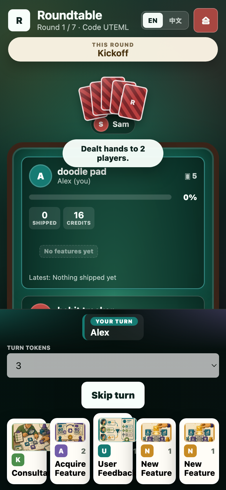
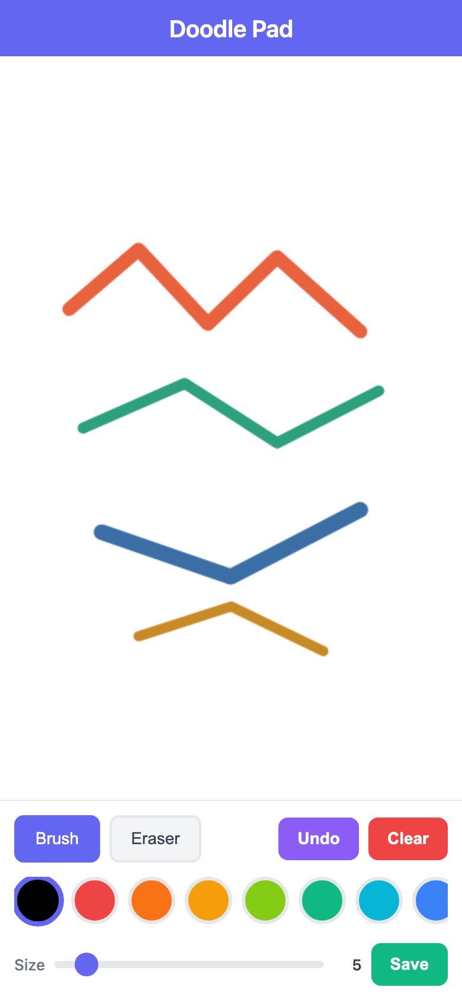
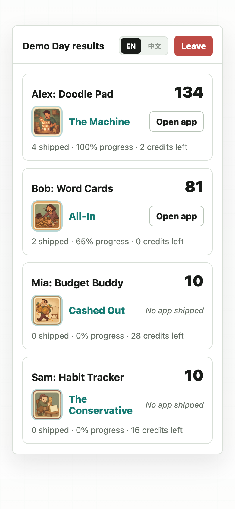

# Roundtable

*English · [中文](README.zh.md)*

[](LICENSE)

**Roundtable** is a browser-based table game about building software products with AI. Two to four players each name a product they want to build, draw a hand of strategy cards, and race to ship the most compelling product by Demo Day. Ship a feature and the host's AI builds it into a **real, working phone app** you can open and use.

It plays like a card game, not a form: opponents sit across the table holding face-down hands, a shared board tracks every product's progress, and a running log narrates what just happened.

Play it **online** — one person hosts, everyone else joins from their own device with a private hand using a short room code — or **pass & play** on a single screen.



## Highlights

- **Play online together.** Host a game, share a 5-character code, and friends join from anywhere on their own devices. The server is authoritative and keeps each player's hand private; the board updates live over lightweight polling that survives any tunnel or proxy.
- **Type any product.** Product ideas are free text — a drawing app (`画图`), a finance tracker, a flashcard tutor, anything. No preset menus; short Chinese ideas work too.
- **A real card table.** Opponents show fanned face-down cards; your hand sits face-up at the bottom; tap a card to pop it up enlarged with its full description before you play.
- **Ship into a real app.** Play the **New Feature** card to add a concrete feature; ending that turn builds your accumulated features into a genuinely working, self-contained phone app — a real drawing canvas, real flashcards — hosted live so anyone can open it.
- **Founder-archetype awards.** Demo Day crowns each player with a tongue-in-cheek archetype based on how they played — *The Machine*, *Cashed Out*, *The Conservative*… — each with its own card-style badge.
- **Data-driven cards.** Card rules, text, and art are defined in data and assets, so the deck is easy to extend.

## What you build

A turn on which you ship a feature compiles your product into a **self-contained phone app** — a single HTML file that runs as a real, usable app (canvas, forms, local storage), styled like a native mobile screen and adapting to **iOS or Android**. The host serves every player's app live, so you just tap **Open app** to use or share it — no download needed.



## How to play

1. The host opens the app, enters a name and a specific product idea, and creates a game. Everyone else opens the same URL and joins with the room code (or play pass & play on one device). Generic placeholders and Roundtable-themed ideas are rejected.
2. In the lobby the host starts the game — each player is dealt a private hand of five cards, always including at least one **New Feature**.
3. On your turn, play one card (tap to enlarge it, then **Play card**), choosing a target where the card needs one.
4. Ending a turn on which you committed a feature spends some credits and **builds your app** in the background. A turn with only a strategy card — or no card — doesn't build.
5. After seven rounds, **Demo Day** scores everyone, awards each player a founder archetype, and serves every finished app.

## The deck

Five cards, defined in `public/data/cards.json` with bilingual text and matching art in `public/assets/cards/`.

| Card | Cost | Target | Effect |
| --- | --- | --- | --- |
| **New Feature** (新功能) | 1 | self | Add one concrete feature — type it or pick from your idea pool. The only way to grow your app, and guaranteed in your opening hand. |
| **User Feedback** (用户反馈) | 1 | self | Adds one product-relevant idea to your pool for a later New Feature. |
| **Acquire Feature** (收购功能) | 2 | other | Steal a shipped feature from another player (it leaves their product). |
| **Consultant** (顾问) | 0 | other | Offer a rival a paid consult; if they accept, they pay you and you add a feature idea to *their* product. |
| **Cloud Credits** (云额度) | 0 | self | Bank sponsored credits for future builds. |

## Stats & scoring

Each product shows three numbers on the board:

- **Progress** (0–100%) — climbs only when you build. Each build adds `clamp(20 + credits-spent × 5, 6, 45)`.
- **Shipped** — features in your product.
- **Credits** — leftover spending power (`cap − spent + earned`).

At Demo Day:

```
score = progress + shipped × 8 + min(10, leftover credits)
```

…and every player earns a **founder archetype** from those same stats:

| Archetype | Earned by |
| --- | --- |
| **The Machine** (卷王) | shipped the most features |
| **The Finisher** (收官大师) | reached 100% progress |
| **All-In** (孤注一掷) | shipped, then spent every last credit |
| **Lean Founder** (精打细算) | shipped while keeping ≥ half the budget |
| **Steady Builder** (稳健创业者) | the balanced middle ground |
| **The Conservative** (保守派) | shipped nothing, sat on the starting budget |
| **Cashed Out** (套现离场) | shipped nothing, yet *earned* past the starting budget |



### Currency: AI credits

- **Credit cap** — your starting budget (default 16) and the most you'll spend.
- **Earned credits** — income from Consultant payouts and Cloud Credits; spent before your cap so you can keep building without raising it.
- **Turn spend** — a build spends an even share of your remaining credits over the remaining rounds.
- **AI token budget** — 1 credit maps to an 800-token model output cap; a build's app gets `turn spend × 800` tokens. Paid AI feature suggestions cost 1 credit.

## Run

Requires Node.js 20+.

```sh
npm start
```

Then open the printed URL (defaults to <http://localhost:5173>).

## AI builder (optional)

Every feature build is produced by the **host's** configured model — players never need a key, because the build runs on the host's server. With nothing configured, a built-in **offline builder** produces a basic app (no key, no setup). To build richer, genuinely working apps, copy `.env.example` to `.env` and set one OpenAI-compatible source:

**Local model** — free, private, no key (Ollama / LM Studio / llama.cpp):

```sh
AI_API_BASE=http://localhost:11434/v1
AI_MODEL=qwen2.5-coder:7b
```

**Cloud key** — any OpenAI-compatible provider; the host pays for builds (example: Claude via Anthropic's OpenAI-compatible endpoint):

```sh
AI_API_BASE=https://api.anthropic.com/v1
AI_MODEL=claude-sonnet-4-5
AI_API_KEY=sk-ant-...
```

Setting `AI_API_BASE`/`AI_API_KEY` switches the AI builder on; the server prints the active mode on startup and `GET /api/health` reports it as `aiMode`.

## Hosting and joining remotely

One machine runs the server with `npm start`; everyone else plays in their browser against it. There are no accounts — a player is authenticated by the **room code**, a per-game shared secret, so you only need to get the URL and the code to the people you invite.

1. **Host a game.** Start the server, create a game, and share the 5-character room code (for example `EDLE7`) with the players you want.
2. **Make the server reachable.** On the same Wi-Fi, share your machine's `http://<lan-ip>:5173`. Over the internet, put a tunnel in front of it and share that URL instead:

   ```sh
   cloudflared tunnel --url http://localhost:5173   # Cloudflare quick tunnel
   # or
   ngrok http 5173
   ```

   Both print an `https://…` URL and avoid opening router ports. Send players that URL **and** the room code.
3. **Join.** A remote player opens the URL, enters a name and product idea, types the room code, and joins. The host sees them appear in the lobby and can remove anyone before starting.

A shared invite link can prefill the code, name, and product (`?code=EDLE7&name=…&product=…`); the link's code always wins over a stale saved session, so a fresh invite never drops you back into an old room.

**Security model.** The room code is the shared secret — treat it like a password. Codes come from a large random space and joins are rate-limited per connection, so they can't be practically guessed. Only the host can start or kick. Games live in memory only and are dropped after a few idle hours; submitted text is length-limited and sanitized. This is built for friendly games among people you invite, not as a hardened public service — only share a tunnel URL with players you trust, and stop the tunnel when you're done.

## Project structure

```
public/            Static client served to the browser
  index.html         Online entry (home / lobby / live table)
  online.js          Online client: host/join, lobby, polling-driven table
  local.html         Single-device pass & play entry
  app.js             Pass & play game logic and rendering
  styles.css         Home, table, card, lobby, results, and responsive styling
  data/cards.json    Card definitions and bilingual strategy text
  assets/cards/      Card art (one PNG per card id)
  assets/awards/     Founder-archetype badge art
server/
  index.js           HTTP server: static files (gzip), room routes, hosted apps
  engine.js          Authoritative game engine, scoring, archetype awards, redacted views
  rooms.js           In-memory rooms, join codes, polling/presence, build orchestration
  build.js           AI / offline phone-app builder and feature suggestions
scripts/
  screenshot.mjs     Regenerates the README board screenshot
docs/                Screenshots used in this README
```

The online game is server-authoritative: clients send intents (play card, end turn) and render a redacted view fetched by short polling — robust through tunnels that buffer Server-Sent Events — so a player only ever receives their own hand.

## Development

```sh
npm run check        # syntax-check the client and server
npm run screenshot   # regenerate docs/screenshot.png from the live app
```

`npm run screenshot` boots the server, drives a short demo game in headless Chrome, and captures the board. It needs Google Chrome or Chromium installed; set `CHROME_PATH` if it lives in a non-standard location.

## License

Released under the [MIT License](LICENSE). © 2026 Ziwei Zhu.
